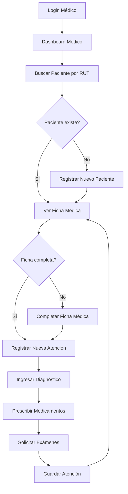
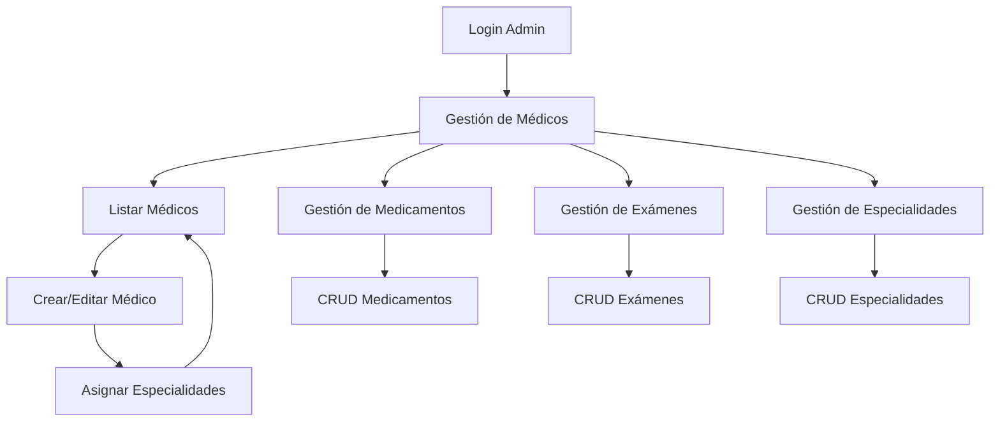

# Documentación Técnica - Sistema de Gestión de Citas Médicas
---En la carpeta tests se realizaron los siguientes tipos de test:
1. Pruebas unitarias del validador de RUT (test_rut_validation.py)
2. Pruebas actualizadas del validador (test_rut_validation_updated.py) 
3. Pruebas con RUT reales (test_with_real_rut.py)
4. Pruebas de restricciones del sistema (test_restricciones.py)
5. Scripts de depuración interactiva (debug_rut.py y debug_rut_v2.py)
Estos tests cubren principalmente la validación de RUT chileno, que es una funcionalidad crítica del sistema. Las pruebas incluyen casos válidos, inválidos, con diferentes formatos y casos especiales como dígitos verificadores 'K' o '0'.

## 📚 Índice
1. [Arquitectura del Sistema](#arquitectura-del-sistema)
2. [Modelos de Datos](#modelos-de-datos)
3. [API y Endpoints](#api-y-endpoints)
4. [Validación de RUT](#validación-de-rut)
5. [Sistema de Autenticación](#sistema-de-autenticación)
6. [Flujos de Trabajo](#flujos-de-trabajo)
7. [Configuración](#configuración)
8. [Testing](#testing)

## 🏗️ Arquitectura del Sistema

### Diagrama de Arquitectura
```
┌─────────────────────────────────────────────────────────────┐
│                    Cliente (Navegador)                      │
└───────────────────────────┬─────────────────────────────────┘
                            │ HTTP/HTTPS
┌───────────────────────────▼─────────────────────────────────┐
│                    Servidor Django                          │
│  ┌──────────────────────────────────────────────────────┐  │
│  │                    Views (Controladores)             │  │
│  │  • dashboard_medico()                               │  │
│  │  • buscar_paciente()                                │  │
│  │  • crear_atencion()                                 │  │
│  │  • lista_medicos()                                  │  │
│  └──────────────────────────────────────────────────────┘  │
│  ┌──────────────────────────────────────────────────────┐  │
│  │                    Models (Modelos)                  │  │
│  │  • Paciente                                         │  │
│  │  • Medico                                           │  │
│  │  • FichaMedica                                      │  │
│  │  • VisitaAtencion                                   │  │
│  └──────────────────────────────────────────────────────┘  │
│  ┌──────────────────────────────────────────────────────┐  │
│  │                    Forms (Formularios)               │  │
│  │  • PacienteForm                                     │  │
│  │  • VisitaAtencionForm                               │  │
│  │  • MedicoForm                                       │  │
│  └──────────────────────────────────────────────────────┘  │
└───────────────────────────┬─────────────────────────────────┘
                            │ ORM
┌───────────────────────────▼─────────────────────────────────┐
│                    Base de Datos (SQLite)                   │
└─────────────────────────────────────────────────────────────┘
```

### Componentes Principales

#### 1. **Capa de Presentación (Templates)**
- Plantillas HTML con Bootstrap
- Separación por roles (admin, médico)
- Formularios con validación rut paciente

#### 2. **Capa de Lógica de Negocio (Views)**
- Controladores Django basados en funciones
- Decoradores de permisos (`@login_required`, `@user_passes_test`)
- Manejo de mensajes con Django Messages Framework

#### 3. **Capa de Datos (Models)**
- Modelos Django con relaciones complejas
- Validadores personalizados (RUT chileno)
- Métodos de negocio en los modelos
- Actualizado modelo Medico: eliminados campos fecha y hora

#### 4. **Capa de Validación (Forms)**
- Formularios Django con validación personalizada
- Clean methods para validación de datos
- Widgets personalizados para mejor UX

## 📊 Modelos de Datos

### Esquema de Base de Datos

```sql
-- Tabla: auth_user (Django por defecto)
CREATE TABLE auth_user (
    id INTEGER PRIMARY KEY,
    username VARCHAR(150) UNIQUE,
    first_name VARCHAR(150),
    last_name VARCHAR(150),
    email VARCHAR(254),
    password VARCHAR(128),
    is_staff BOOLEAN,
    is_active BOOLEAN,
    is_superuser BOOLEAN,
    date_joined DATETIME,
    last_login DATETIME
);

-- Tabla: Agenda_paciente
CREATE TABLE Agenda_paciente (
    id INTEGER PRIMARY KEY,
    user_id INTEGER UNIQUE,
    rut VARCHAR(12) UNIQUE,
    fecha_nacimiento DATE,
    sexo VARCHAR(1),
    telefono VARCHAR(20),
    direccion TEXT,
    email VARCHAR(254),
    FOREIGN KEY (user_id) REFERENCES auth_user(id)
);

-- Tabla: Agenda_medico
CREATE TABLE Agenda_medico (
    id INTEGER PRIMARY KEY,
    user_id INTEGER UNIQUE,
    rut VARCHAR(12) UNIQUE,
    foto VARCHAR(100),
    dias_laborales VARCHAR(100),
    FOREIGN KEY (user_id) REFERENCES auth_user(id)
);

-- Tabla: Agenda_fichamedica
CREATE TABLE Agenda_fichamedica (
    id INTEGER PRIMARY KEY,
    paciente_id INTEGER UNIQUE,
    alergias TEXT,
    enfermedades_cronicas TEXT,
    medicamentos TEXT,
    antecedentes_familiares TEXT,
    FOREIGN KEY (paciente_id) REFERENCES Agenda_paciente(id)
);

-- Tabla: Agenda_especialidad
CREATE TABLE Agenda_especialidad (
    id INTEGER PRIMARY KEY,
    nombre VARCHAR(100)
);

-- Tabla: Agenda_medico_especialidades (ManyToMany)
CREATE TABLE Agenda_medico_especialidades (
    id INTEGER PRIMARY KEY,
    medico_id INTEGER,
    especialidad_id INTEGER,
    FOREIGN KEY (medico_id) REFERENCES Agenda_medico(id),
    FOREIGN KEY (especialidad_id) REFERENCES Agenda_especialidad(id)
);

-- Tabla: Agenda_visitaatencion
CREATE TABLE Agenda_visitaatencion (
    id INTEGER PRIMARY KEY,
    paciente_id INTEGER,
    medico_id INTEGER,
    especialidad_id INTEGER,
    anamnesis TEXT,
    diagnostico TEXT,
    fecha_atencion DATETIME,
    FOREIGN KEY (paciente_id) REFERENCES Agenda_paciente(id),
    FOREIGN KEY (medico_id) REFERENCES Agenda_medico(id),
    FOREIGN KEY (especialidad_id) REFERENCES Agenda_especialidad(id)
);

-- Tablas ManyToMany para medicamentos y exámenes
CREATE TABLE Agenda_visitaatencion_medicamentos (...);
CREATE TABLE Agenda_visitaatencion_examenes (...);
```

### Relaciones entre Modelos

```
User (auth_user)
├── OneToOne → Paciente
│   └── OneToOne → FichaMedica
│       └── (Historial) ← VisitaAtencion
└── OneToOne → Medico
    ├── ManyToMany → Especialidad
    └── (Atenciones) → VisitaAtencion

VisitaAtencion
├── ForeignKey → Paciente
├── ForeignKey → Medico
├── ForeignKey → Especialidad
├── ManyToMany → Medicamentos
└── ManyToMany → Examenes
```

## 🔌 API y Endpoints

### Rutas Principales

#### Autenticación (`registration/urls.py`)
```
/Accounts/login/          # Login de usuarios
/Accounts/logout/         # Logout de usuarios
/Accounts/register/       # Registro de pacientes
```

#### Agenda Principal (`Agenda/urls.py`)
```
/                         # Página de inicio
/medico/dashboard/        # Dashboard médico
/medico/paciente/buscar/  # Búsqueda de pacientes
/medico/paciente/registrar/ # Registro de pacientes
/medico/ficha/<id>/       # Ver ficha médica
/medico/ficha/editar/<id>/ # Editar ficha médica
/medico/atencion/nueva/<id>/ # Nueva atención
```

#### Gestión Administrativa
```
/gestion/medicos/         # Lista de médicos
/gestion/medicos/crear/   # Crear médico
/gestion/medicos/editar/<pk>/ # Editar médico
/gestion/medicos/eliminar/<pk>/ # Eliminar médico

/gestion/medicamentos/    # Gestión de medicamentos
/gestion/examenes/        # Gestión de exámenes
/gestion/especialidades/  # Gestión de especialidades
```

### Vistas Clave

#### 1. **Dashboard Médico** (`dashboard_medico`)
```python
@login_required
@user_passes_test(es_medico)
def dashboard_medico(request):
    medico = request.user.medico
    atenciones = VisitaAtencion.objects.filter(medico=medico).order_by("-fecha_atencion")
    return render(request, "Agenda/dashboard_medico.html", {"citas": atenciones})
```

#### 2. **Búsqueda de Paciente** (`buscar_paciente`)
```python
@login_required
@user_passes_test(es_medico)
def buscar_paciente(request):
    query = request.GET.get("rut")
    paciente = None
    
    if query:
        paciente = Paciente.objects.filter(rut=query).first()
        if not paciente:
            messages.warning(request, f"No se encontró paciente con RUT {query}.")
            return redirect("registrar_paciente")
        else:
            return redirect("ver_ficha", paciente_id=paciente.id)
    
    return render(request, "Agenda/buscar_paciente.html")
```

#### 3. **Crear Atención** (`crear_atencion`)
```python
@login_required
@user_passes_test(es_medico)
def crear_atencion(request, paciente_id):
    paciente = get_object_or_404(Paciente, id=paciente_id)
    medico = request.user.medico
    
    if request.method == "POST":
        form = VisitaAtencionForm(request.POST, medico=medico)
        if form.is_valid():
            atencion = form.save(commit=False)
            atencion.paciente = paciente
            atencion.medico = medico
            atencion.save()
            form.save_m2m()  # Guardar relaciones ManyToMany
            messages.success(request, "Atención registrada correctamente.")
            return redirect("ver_ficha", paciente_id=paciente.id)
    else:
        form = VisitaAtencionForm(medico=medico)
    
    return render(request, "Agenda/crear_atencion.html", {"form": form, "paciente": paciente})
```

## 🔐 Validación de RUT

### Algoritmo de Validación

El sistema implementa el algoritmo oficial de validación de RUT chileno (Módulo 11):

```python
def validar_rut_chileno(rut):
    # 1. Normalización
    rut = rut.replace(".", "").replace("-", "").replace(" ", "").upper()
    
    # 2. Validación de formato
    if len(rut) < 8 or len(rut) > 9:
        raise ValidationError("RUT inválido")
    
    # 3. Separación cuerpo/dígito verificador
    dv = rut[-1]          # Último carácter
    cuerpo = rut[:-1]     # Resto del RUT
    
    # 4. Validación de caracteres
    if not cuerpo.isdigit():
        raise ValidationError("RUT inválido")
    if dv not in "0123456789K":
        raise ValidationError("RUT inválido")
    
    # 5. Cálculo dígito verificador
    reversed_cuerpo = cuerpo[::-1]
    secuencia = [2, 3, 4, 5, 6, 7]
    suma = 0
    
    for i, digito in enumerate(reversed_cuerpo):
        multiplicador = secuencia[i % len(secuencia)]
        suma += int(digito) * multiplicador
    
    resto = suma % 11
    dv_calculado = 11 - resto
    
    # 6. Mapeo de resultados especiales
    if dv_calculado == 10:
        dv_calculado = "K"
    elif dv_calculado == 11:
        dv_calculado = "0"
    else:
        dv_calculado = str(dv_calculado)
    
    # 7. Comparación
    if dv != dv_calculado:
        raise ValidationError("RUT inválido")
    
    # 8. Formateo estándar
    return f"{cuerpo}-{dv}"
```

### Formatos Aceptados
- `12345678-9` (estándar)
- `12.345.678-9` (con puntos)
- `123456789` (sin formato)
- `12345678-k` (minúscula/mayúscula)

### Casos Especiales
- Dígito verificador 'K' (10)
- Dígito verificador '0' (11)
- RUTs de 7 u 8 dígitos

## 👥 Sistema de Autenticación

### Roles y Permisos

#### Decoradores de Permisos
```python
def es_medico(user):
    return user.is_authenticated and hasattr(user, "medico")

def es_admin(user):
    return user.is_authenticated and user.is_staff

# Uso en vistas
@login_required
@user_passes_test(es_medico)
def vista_solo_medicos(request):
    pass
```

### Flujo de Autenticación

```python
def loginView(request):
    form = AuthenticationForm(request, data=request.POST or None)
    
    if request.method == "POST":
        if form.is_valid():
            user = form.get_user()
            login(request, user)
            
            # Redirección según rol
            if user.is_staff:
                return redirect("lista_medicos")  # Admin
            elif hasattr(user, "medico"):
                return redirect("/")  # Médico
            else:
                return redirect("home")  # Paciente
```

### Registro de Pacientes
- Username = RUT del paciente
- Contraseña inicial = RUT
- Creación automática de ficha médica vacía

## 🔄 Flujos de Trabajo

### Flujo Médico Completo



### Flujo Administrativo



## ⚙️ Configuración

### Settings Django (`Gestios_Citas_IS/settings.py`)

```python
# Configuración básica
DEBUG = True
ALLOWED_HOSTS = []
SECRET_KEY = 'django-insecure-...'

# Aplicaciones instaladas
INSTALLED_APPS = [
    'django.contrib.admin',
    'django.contrib.auth',
    'django.contrib.contenttypes',
    'django.contrib.sessions',
    'django.contrib.messages',
    'django.contrib.staticfiles',
    'Agenda',
    'registration',
]

# Base de datos
DATABASES = {
    'default': {
        'ENGINE': 'django.db.backends.sqlite3',
        'NAME': BASE_DIR / 'db.sqlite3',
    }
}

# Archivos multimedia
MEDIA_URL = '/media/'
MEDIA_ROOT = BASE_DIR / 'media'
```

### Configuración para Producción

1. **Base de Datos PostgreSQL**
```python
DATABASES = {
    'default': {
        'ENGINE': 'django.db.backends.postgresql',
        'NAME': 'gestios_citas',
        'USER': 'usuario',
        'PASSWORD': 'contraseña',
        'HOST': 'localhost',
        'PORT': '5432',
    }
}
```

2. **Configuración de Seguridad**
```python
DEBUG = False
ALLOWED_HOSTS = ['tudominio.com', 'www.tudominio.com']
SECURE_SSL_REDIRECT = True
SESSION_COOKIE_SECURE = True
CSRF_COOKIE_SECURE = True
```

3. **Archivos Estáticos**
```python
STATIC_ROOT = BASE_DIR / 'staticfiles'
STATICFILES_STORAGE = 'django.contrib.staticfiles.storage.ManifestStaticFilesStorage'
```

## 🧪 Testing

### Estructura de Testing

Los archivos de testing están organizados en la carpeta `tests/`:

```
tests/
├── test_rut_validation.py          # Pruebas unitarias del validador de RUT
├── test_rut_validation_updated.py  # Pruebas actualizadas del validador
├── test_with_real_rut.py           # Pruebas con RUT reales
├── test_restricciones.py           # Pruebas de restricciones del sistema
├── debug_rut.py                    # Depuración interactiva del validador
└── debug_rut_v2.py                 # Versión mejorada de depuración
```

### Pruebas de Validación de RUT

El proyecto incluye pruebas exhaustivas para el validador de RUT:

```python
# tests/test_rut_validation.py
def test_rut_valido_con_puntos():
    rut = "12.345.678-5"
    resultado = validar_rut_chileno(rut)
    assert resultado == "12345678-5"

def test_rut_valido_sin_formato():
    rut = "123456785"
    resultado = validar_rut_chileno(rut)
    assert resultado == "12345678-5"

def test_rut_invalido_digito_verificador():
    rut = "12345678-9"  # Dígito correcto es 5
    with pytest.raises(ValidationError):
        validar_rut_chileno(rut)
```

### Ejecución de Pruebas

```bash
# Ejecutar pruebas de Django
python manage.py test

# Ejecutar pruebas específicas de la aplicación
python manage.py test Agenda.tests

# Ejecutar pruebas de RUT específicas
python tests/test_rut_validation.py
python tests/test_with_real_rut.py

# Ejecutar con cobertura
coverage run manage.py test
coverage report
```

### Scripts de Depuración

- `tests/debug_rut.py`: Depuración interactiva del validador
- `tests/debug_rut_v2.py`: Versión mejorada de depuración
- `tests/test_with_real_rut.py`: Pruebas con RUT reales
- `tests/test_restricciones.py`: Pruebas de restricciones del sistema

## 🔧 Mantenimiento

### Comandos de Administración

```bash
# Migraciones
python manage.py makemigrations
python manage.py migrate

# Crear superusuario
python manage.py createsuperuser

# Shell interactivo
python manage.py shell

# Backup de base de datos
python manage.py dumpdata > backup.json

# Restaurar backup
python manage.py loaddata backup.json
```

### Limpieza de Datos

```python
# Script para limpiar datos antiguos
from django.utils import timezone
from datetime import timedelta
from Agenda.models import VisitaAtencion

# Eliminar atenciones mayores a 5 años
fecha_limite = timezone.now() - timedelta(days=5*365)
VisitaAtencion.objects.filter(fecha_atencion__lt=fecha_limite).delete()
```

## 📈 Escalabilidad

### Consideraciones de Rendimiento

1. **Indexación de Base de Datos**
```python
class Paciente(models.Model):
    rut = models.CharField(max_length=12, unique=True, db_index=True)
    # ... otros campos
```

2. **Optimización de Consultas**
```python
# Usar select_related para ForeignKey
atenciones = VisitaAtencion.objects.select_related(
    'paciente', 'medico', 'especialidad'
).filter(medico=medico)

# Usar prefetch_related para ManyToMany
atenciones = atenciones.prefetch_related('medicamentos', 'examenes')
```

3. **Paginación**
```python
from django.core.paginator import Paginator

def lista_medicos(request):
    medicos_list = Medico.objects.all()
    paginator = Paginator(medicos_list, 20)  # 20 por página
    page = request.GET.get('page')
    medicos = paginator.get_page(page)
    return render(request, "Agenda/medicos.html", {"medicos": medicos})
```

### Consideraciones de Seguridad

1. **Protección contra Inyección SQL**
- Django ORM previene inyecciones automáticamente
- Nunca usar consultas SQL crudas con datos de usuario

2. **Validación de Entradas**
- Validación en formularios Django
- Sanitización de datos en views
- Validación de RUT en backend

3. **Protección CSRF**
- Middleware CSRF habilitado por defecto
- Tokens CSRF en todos los formularios

---

*Documentación actualizada: Diciembre 2025*  
*Versión del sistema: 1.1.0*  
*Framework: Django 5.2.7*